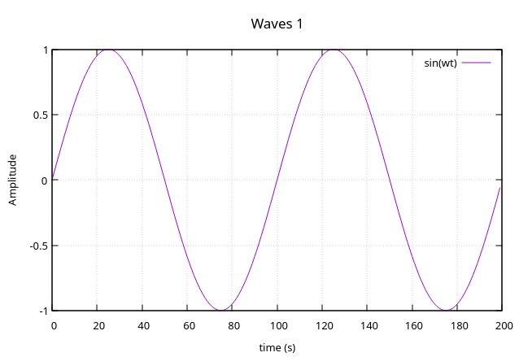
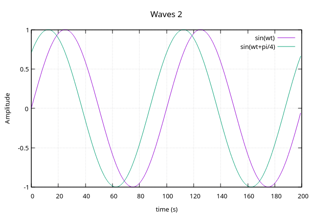
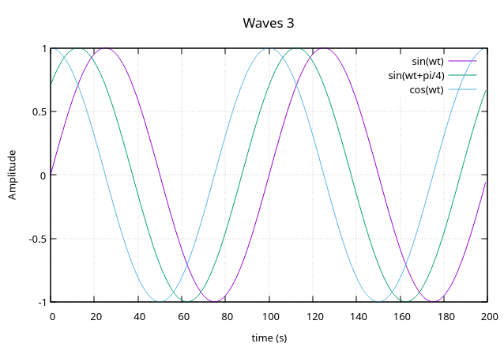
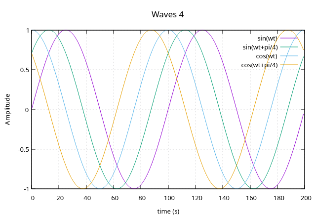
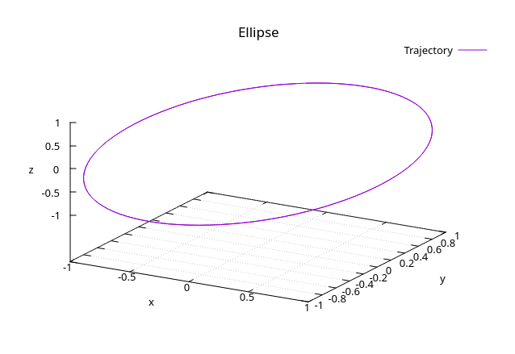

# Gnuplot for Odin

*Simple wrapper for 2D and 3D line plots from discrete samples*

## Description

This library provides basic procedures to plot up to four data samples in the same graphic or to plot one sample of 3D coordinates.

It is intended to be used in simulations where each point (or 2D vector, 3D vector or quaternion) is being calculated in each iteration. Therefore, whenever the parameter is updated it can be written into Gnuplot without storing the samples in a buffer.

With this in mind, excluding the 3D plots, the x-axis (time axis) data is automatically incremented from 0 up to the number of points provided after all iterations.

Each plot is shown in separate windows by creating dedicated pipes between this library and Gnuplot which also enables updating the sample for each plot before printing the plot.

If you know Gnuplot commands, you can edit the library to customize the plots with different font sizes, colors, thickness, etc.

## Plot examples

This library can provide the following types of plots.

## Dependencies

Install Gnuplot before running the program.

## Build and run

Run `make` to compile the code and then run `make run` to execute the demonstration program.

## License

This project is licensed under the MIT Open Source License.
